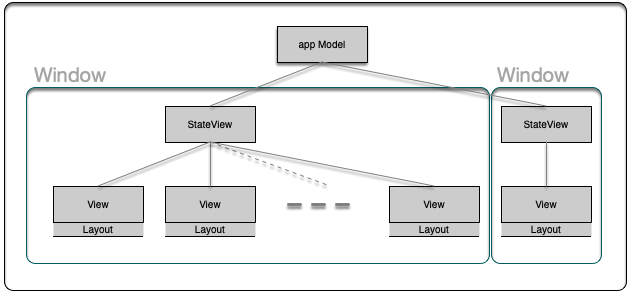

# Introduction

Gowi (*Get On With It*) is a feature complete(ish) implementation in SwiftUI of a canonical "Todo" example application.

The goals of the project are to:

1. Determine and document how to:

    2. Achieve established platform norms using SwiftUI.
    2. Test that it does.
    
2. Form a usable \* and scalable basis for future experimentation and development, e.g. add `iPadOS` version, work 
sharing, time estimation, richer text editing ...

\* **For small personal projects.**

# Supported platforms

Gowi runs on `macOS` and requires Ventura version 13.0 or better 

# Current User Capabilities 

The app provides the user with an interface to create, update and manage work-package *todo* `Item`s. 

Each of the user's *todo* `Item`s have a unique Id, Title, Notes, Creation and Completion dates and a Priority attribute 
associated with it. 

And each of these attributes - Id and Creation date aside - may be altered by the user.

To help the user to find their `Item`s the app:

- Provides URL routing to:
	1. `Item`s within the system, e.g. [gowi://main/v1/showitems?fid=All&id=42FA9B5A-959A-42C3-A5D1-184E634E2E33](gowi://main/v1/showitems?fid=All&id=42FA9B5A-959A-42C3-A5D1-184E634E2E33)
	2. Lists of `Item`s
- And uses the `Item`'s Completion date to derive lists of them that are either:
	- Waiting for action sorted by their Priority relative to one and other. Or,
	- Done and sorted by completion date.

For convenience, most of  the app's functionality is deep linkable through a predictable versioned URL interface e.g.

- New `Item` creation - [gowi://main/v1/newItem](gowi://main/v1/newItem)
- The list of:
	- All `Item`s - [gowi://main/v1/showitems?fid=All](gowi://main/v1/showitems?fid=All)
    - Done  `Item`s - [gowi://main/v1/showitems?fid=Done](gowi://main/v1/showitems?fid=Done)
    - Waiting `Item`s - [gowi://main/v1/showitems?fid=Waiting](gowi://main/v1/showitems?fid=Waiting)

 
It guards against accidental user data loss through app termination with unsaved changes.

And the app persists the user's data - and is syncable to their other devices - via their private iCloud account. 

Further, on `macOs` it endeavours to follow the de-facto platform conventions for:

- Drag and drop list rearrangement, e.g. when adjusting `Item` priorities in the Waiting list.
- Keyboard shortcut keys and menu structures.
- Keyboard navigation.
- Pop-up text.
- Multi-window behaviour.
- Lists having context menus and are navigable by typing title characters.
- Universal undo and redo capabilities for user data.

 

# Developer notes
## Compiling and testing

- Targets `macOS` Ventura 13.XX.
- Known to compile and pass its Unit and UI tests with `Xcode 14.1` on Ventura 13.1 (Intel)
- Testing
	- Unit test target is `GowiTests`
	- UI test test target is`GowiUITests`
	- Being used to manage Gowi tasks, i.e. dogfooding, on Ventura.

## Expected app behaviour - see test cases under `GowiUITests`

Aside from playing with the app and reading the code, the app's UI tests cover most of its functionality and aims to 
provide a good plain-English introduction to app's expected behaviour.

## What is in the demo?
### Key things ...

- An alternative - non `MVVM` - scheme for the scalable general integration of bespoke app state and business logic with 
SwiftUI's prebuilt *@someStore* and *@someControl* functionality. 
- Sensible, ubiquitous user data undo capability through the combination of SwiftUI's built in `UndoManager`, a bespoke 
`viewContext.undoManager` and `@FocusedValue` driven undo/redo stack grouping.
- How to use `@NSApplicationDelegateAdaptor` with an `AppKit.NSApplicationDelegate` to protect users from app 
termination with unsaved data.
- An in-app routing scheme to open and handle multi-window, tabs and rich URL  requests on `macOS`.
- How to test it.

### Other bits ... 

- A hierarchical `CoreData` scheme with a syncable CloudKit` backend and its own `UndoManager`.
- `@FetchRequest` - for retrieving `CoreData`
- `@SceneStorage` - to enable window config restoration across app restarts.
- `@FocusedValues` - to communicate with the app's Menubar where the user is currently working and which window's state 
it should be using in its controls.
- App specific Menubar and keyboard shortcuts.
- Sorted `ForEach` lists with drag and drop list rearrangement.
- Copy to clipboard for user data.

## App Architecture - Model StateView View (MSV) 

Good app architecture for SwiftUI needs to balance the needs for:

- Performance
- Accommodating 3rd party solutions, i.e. not being an all-or-nothing solution.
	- In particular cope with SwiftUI's *@someStore* and *@someControl* built-in functionality.
- Separating and de-coupling concerns.
- Minimising boiler-plate.
- Enabling the straightforward testing of developed designs.
- The ease with which it is readily understood and applied by developers.

This app attempts to achieve this balance through the use of an empirically derived Model StateView View (MSV) approach.

In this architecture the 

- Model is the app's model of its Business Logic and Data.
	- Codebase example  =>  `AppModel`
- StateView are one or more (usually one per Window/Scene) high level SwiftUI Views that:
	- Do minimal - or no - UI layout.
	- Centralises access for a window or scene to the:
		- App model 
		- SwiftUI *@someStore* and *@someControl*  functionality.
	- Combine the data to derive the state and the Intents for all of its sub-views. 
		- With the Intents being split into instance and static parts to facilitate Unit testing and the generation of 
        Previews.
	- Reduce boiler-plate "prop-drilling"
	- Codebase examples:
		- SwiftUI *@someStore* injection =>  `Main`
		- Intents:
			- Window => `Main#Model`
			- Sidebar sub-components => `Main#SidebarModel`
			- Content sub-components => `Main#ContentModel`
			- Detail sub-components => in `Main#DetailModel`
- Views are:
	- Almost entirely stateless.
	- Use a StateView adapter and Layout pattern
		-  Layout works in concert with the StateView's Intent static part and Model to enable Preview testing without 
        initialising StateView.
	-  Codebase examples `Main#DetailView` and  `ItemView` 

## Source code documentation

Is hopefully extensive and useful.  

- `Main#WindowGroupRouteView` goes into some depth about how the dark-arts of making SwiftUI route works.
- `Main#WindowGroupUndoView`  attempts to get over how undo management works. 

Thanks for reading down to here - Have fun! 🙂

      

